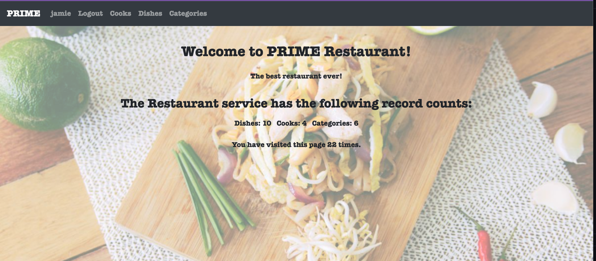
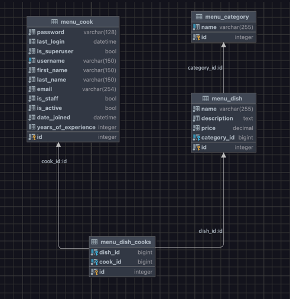

# Restaurant kitchen-service

Django project for cooks and dishes in restaurant

## Check it out!

[Restaurant project deployed to Render](https://restaurant-kitchen-o60g.onrender.com) 

## Instalation

Python must be already installed

```shell
git clone https://github.com/KatrinLazarenko/restaurant-kitchen-service
cd restaurant-kitchen-service
python3 -m venv venv
source venv/bin/activate
pip install -r requirements.txt
python manage.py runserver
```

## Features
*Authentication functionality for Cook/User
*Managing dishes cooke and dish categories directly from web-site
*Admin panel for advanced managing 

You can use the following for access:
login: jamie
password: lkjhg987

## Demo

